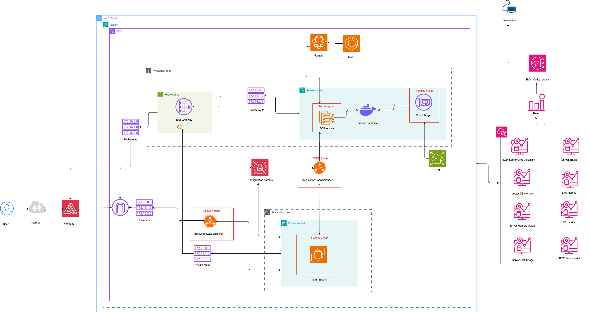
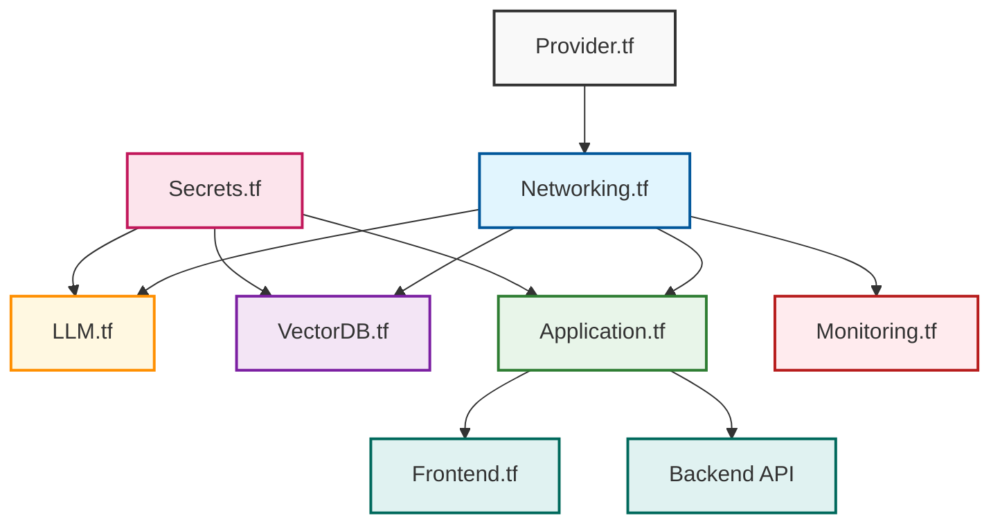
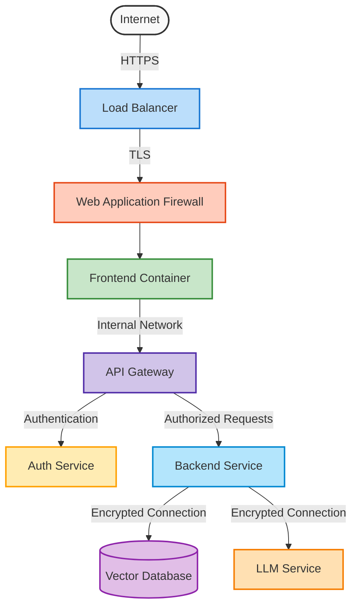

# 🏗️ QueryGPT Infrastructure

<div align="center">


</div>

Infrastructure as Code (IaC) setup and configuration for deploying and managing QueryGPT in production environments. This module leverages Terraform to provision and maintain all necessary cloud resources with consistency and reliability.

<div align="center">

</div>

## 🏛️ System Architecture

<div align="center">
  
  <p><em>Comprehensive AWS cloud infrastructure diagram showing the complete QueryGPT deployment architecture</em></p>
</div>

The architecture diagram above illustrates our production deployment on AWS Cloud, featuring:

- **Multi-AZ Deployment**: High availability across availability zones
- **Security Groups**: Fine-grained access control between components
- **Load Balancing**: Traffic distribution and failover management
- **Private/Public Subnets**: Network isolation for enhanced security
- **Monitoring**: Comprehensive metrics collection for all system components

## 🎯 Infrastructure Components

<table>
  <tr>
    <td align="center">🧠</td>
    <td><b>Ollama</b></td>
    <td>Self-hosted LLM service for privacy-focused AI capabilities</td>
  </tr>
  <tr>
    <td align="center">🔍</td>
    <td><b>Qdrant</b></td>
    <td>Vector database for efficient similarity search and embedding storage</td>
  </tr>
  <tr>
    <td align="center">🖥️</td>
    <td><b>Frontend</b></td>
    <td>Containerized React application with Nginx for static file serving</td>
  </tr>
  <tr>
    <td align="center">⚙️</td>
    <td><b>Backend</b></td>
    <td>FastAPI service container with Python runtime environment</td>
  </tr>
  <tr>
    <td align="center">🔄</td>
    <td><b>Nginx</b></td>
    <td>Reverse proxy for routing, SSL termination, and load balancing</td>
  </tr>
  <tr>
    <td align="center">📊</td>
    <td><b>Monitoring</b></td>
    <td>Observability stack for system metrics and performance tracking</td>
  </tr>
</table>

## 🔧 Terraform Configuration

The infrastructure is defined using Terraform modules for clean organization and reusability:

<div align="center">



</div>

### Key Configuration Files

<table>
  <tr>
    <th>File</th>
    <th>Purpose</th>
  </tr>
  <tr>
    <td><code>Provider.tf</code></td>
    <td>Cloud provider configuration and version constraints</td>
  </tr>
  <tr>
    <td><code>Networking.tf</code></td>
    <td>VPC, subnets, security groups, and network access</td>
  </tr>
  <tr>
    <td><code>LLM.tf</code></td>
    <td>Ollama service deployment and configuration</td>
  </tr>
  <tr>
    <td><code>VectorDB.tf</code></td>
    <td>Qdrant database instance provisioning</td>
  </tr>
  <tr>
    <td><code>Application.tf</code></td>
    <td>Shared application resources and configurations</td>
  </tr>
  <tr>
    <td><code>Frontend.tf</code></td>
    <td>Frontend application deployment</td>
  </tr>
  <tr>
    <td><code>Monitoring.tf</code></td>
    <td>Observability and alerting setup</td>
  </tr>
  <tr>
    <td><code>Secrets.tf</code></td>
    <td>Secret management for secure storage of credentials</td>
  </tr>
</table>

## 🚀 Deployment Options

### Local Development

```bash
# Initialize Terraform
terraform init

# Plan changes
terraform plan

# Apply changes
terraform apply

# For local testing with Docker Compose
docker-compose up -d
```

### Cloud Deployment

```bash
# Configure cloud credentials
export AWS_ACCESS_KEY_ID="your-key-id"
export AWS_SECRET_ACCESS_KEY="your-secret-key"
# OR for other cloud providers
# ...

# Initialize with backend
terraform init -backend-config=environments/prod/backend.tfvars

# Deploy with production variables
terraform apply -var-file=environments/prod/terraform.tfvars
```

## 💾 Data Persistence Strategy

<table>
  <tr>
    <th>Component</th>
    <th>Storage Type</th>
    <th>Backup Strategy</th>
  </tr>
  <tr>
    <td>Qdrant Vector Database</td>
    <td>Persistent volume with SSD backing</td>
    <td>Daily snapshots with 7-day retention</td>
  </tr>
  <tr>
    <td>Uploaded Documents</td>
    <td>Object storage (S3-compatible)</td>
    <td>Versioned storage with cross-region replication</td>
  </tr>
  <tr>
    <td>LLM Model Weights</td>
    <td>Persistent volume</td>
    <td>Version-controlled with immutable tags</td>
  </tr>
  <tr>
    <td>Application State</td>
    <td>Database (PostgreSQL)</td>
    <td>Point-in-time recovery with WAL archiving</td>
  </tr>
</table>

## 🔐 Security Architecture

<div align="center">



</div>

- **Network Isolation**: Private subnets with restrictive security groups
- **Secret Management**: Encrypted environment variables and vault integration
- **Access Control**: Role-based access control (RBAC) for all services
- **SSL/TLS**: End-to-end encryption with automatic certificate renewal
- **Data Protection**: Encrypted at rest and in transit
- **Compliance**: Built with GDPR and CCPA considerations

## 📊 Monitoring & Observability

<table>
  <tr>
    <td align="center">🔍</td>
    <td><b>Container Health</b></td>
    <td>Liveness and readiness probes for each service</td>
  </tr>
  <tr>
    <td align="center">📈</td>
    <td><b>Resource Metrics</b></td>
    <td>CPU, memory, disk, and network tracking</td>
  </tr>
  <tr>
    <td align="center">📝</td>
    <td><b>Centralized Logging</b></td>
    <td>Structured logging with search capabilities</td>
  </tr>
  <tr>
    <td align="center">⏱️</td>
    <td><b>Performance Tracking</b></td>
    <td>Query latency and response time monitoring</td>
  </tr>
  <tr>
    <td align="center">🚨</td>
    <td><b>Alerting</b></td>
    <td>Automated notifications for critical events</td>
  </tr>
  <tr>
    <td align="center">📊</td>
    <td><b>Dashboards</b></td>
    <td>Visual displays of system health and performance</td>
  </tr>
</table>

## 🔄 Continuous Integration/Deployment

The infrastructure supports a fully automated CI/CD pipeline:

1. **Infrastructure Validation**: Automated checks for Terraform configuration
2. **Security Scanning**: Vulnerability assessment of Docker images
3. **Deployment Automation**: Zero-downtime rolling updates
4. **Configuration Management**: Version-controlled infrastructure changes
5. **Disaster Recovery**: Automated backup/restore procedures
