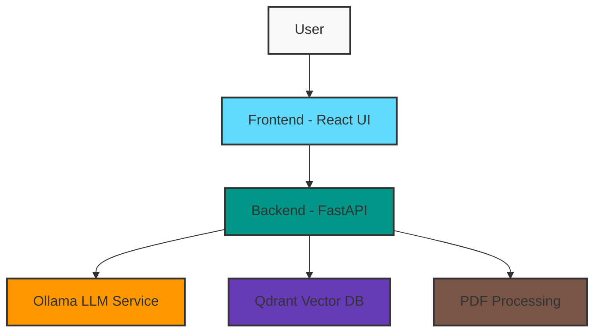
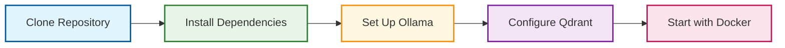

# 🔍 QueryGPT: SQL Schema Query Assistant

<div align="center">
  


  
</div>

A sophisticated RAG-based application that transforms how you interact with SQL databases. **QueryGPT** bridges the gap between natural language and SQL, enabling users to query complex database schemas through simple conversation. Simply upload your schema documentation, ask questions in plain English, and get accurate SQL queries in return.

<div align="center">
  
```
Your Question → QueryGPT → SQL Query → Database Insights
```
  
</div>

## 🌟 Key Features

- **📄 PDF Schema Processing**: Upload and process SQL schema documentation in PDF format
- **💬 Natural Language to SQL**: Convert conversational questions into precise SQL queries
- **🖥️ Interactive Query Interface**: User-friendly interface with real-time feedback
- **🧠 Self-hosted LLM**: Privacy-focused approach utilizing Ollama for local LLM hosting
- **🔎 Vector Search**: Lightning-fast retrieval powered by Qdrant vector database

## 🏗️ System Architecture

<div align="center">
  


</div>

## 🔧 Technology Stack

<table>
  <tr>
    <td align="center"><b>🧠 LLM Engine</b></td>
    <td>Self-hosted Ollama - providing privacy-focused AI capabilities</td>
  </tr>
  <tr>
    <td align="center"><b>🔍 Vector Database</b></td>
    <td>Qdrant - high-performance similarity search and vector storage</td>
  </tr>
  <tr>
    <td align="center"><b>🖥️ Frontend</b></td>
    <td>React.js with TypeScript - responsive and type-safe UI</td>
  </tr>
  <tr>
    <td align="center"><b>⚙️ Backend</b></td>
    <td>Python with FastAPI - high-performance, easy-to-use API framework</td>
  </tr>
  <tr>
    <td align="center"><b>📄 Document Processing</b></td>
    <td>LangChain + PyPDF2 - robust document handling and extraction pipeline</td>
  </tr>
  <tr>
    <td align="center"><b>📦 Deployment</b></td>
    <td>Docker & Docker Compose - containerized for consistent deployment</td>
  </tr>
</table>

## 💾 Why Qdrant for Vector Storage?

<div align="center">

</div>

Qdrant powers our semantic search capabilities with several key advantages:

<table>
  <tr>
    <td align="center">⚡</td>
    <td><b>High Performance</b></td>
    <td>Memory-efficient architecture with disk persistence for reliability</td>
  </tr>
  <tr>
    <td align="center">🧩</td>
    <td><b>Simple Architecture</b></td>
    <td>Easy to deploy and maintain with minimal configuration</td>
  </tr>
  <tr>
    <td align="center">🔍</td>
    <td><b>Flexible Search</b></td>
    <td>Rich filtering capabilities with payload for precise retrieval</td>
  </tr>
  <tr>
    <td align="center">🚀</td>
    <td><b>Production Ready</b></td>
    <td>Built for production workloads with scalability in mind</td>
  </tr>
  <tr>
    <td align="center">👐</td>
    <td><b>Open Source</b></td>
    <td>Active community and regular updates ensure longevity</td>
  </tr>
  <tr>
    <td align="center">🦀</td>
    <td><b>Native Rust</b></td>
    <td>Implemented in Rust for optimal performance and safety</td>
  </tr>
</table>

## 📚 Getting Started

<div align="center">



</div>

1. **Clone the repository**
   ```bash
   git clone https://github.com/yourusername/QueryGPT.git
   cd QueryGPT
   ```

2. **Install dependencies** (see individual component READMEs for details)

3. **Set up Ollama with required models**
   ```bash
   # Install Ollama
   curl https://ollama.ai/install.sh | sh
   # Pull necessary model
   ollama pull llama2
   ```

4. **Configure Qdrant database**
   ```bash
   # Using Docker
   docker pull qdrant/qdrant
   ```

5. **Start the application**
   ```bash
   docker-compose up -d
   ```

## 🔗 Component Documentation

<div class="grid" style="display: grid; grid-template-columns: repeat(3, 1fr); gap: 20px;">
  <div style="border: 1px solid #ddd; padding: 15px; border-radius: 8px; text-align: center;">
    <h3>🖥️ Frontend</h3>
    <p>React-based UI for user interaction</p>
    <a href="./frontend/README.md">View Documentation</a>
  </div>
  <div style="border: 1px solid #ddd; padding: 15px; border-radius: 8px; text-align: center;">
    <h3>⚙️ Backend</h3>
    <p>FastAPI service powering the RAG pipeline</p>
    <a href="./backend/README.md">View Documentation</a>
  </div>
  <div style="border: 1px solid #ddd; padding: 15px; border-radius: 8px; text-align: center;">
    <h3>🏗️ Infrastructure</h3>
    <p>Deployment and configuration</p>
    <a href="./Infrastructure/README.md">View Documentation</a>
  </div>
</div>

## 📋 Prerequisites

<table>
  <tr>
    <th>Requirement</th>
    <th>Version</th>
    <th>Purpose</th>
  </tr>
  <tr>
    <td>Docker & Docker Compose</td>
    <td>Latest</td>
    <td>Container orchestration</td>
  </tr>
  <tr>
    <td>Node.js</td>
    <td>16+</td>
    <td>Frontend development</td>
  </tr>
  <tr>
    <td>Python</td>
    <td>3.8+</td>
    <td>Backend development</td>
  </tr>
  <tr>
    <td>Ollama</td>
    <td>Latest</td>
    <td>LLM hosting</td>
  </tr>
  <tr>
    <td>Qdrant</td>
    <td>Latest</td>
    <td>Vector database</td>
  </tr>
</table>
