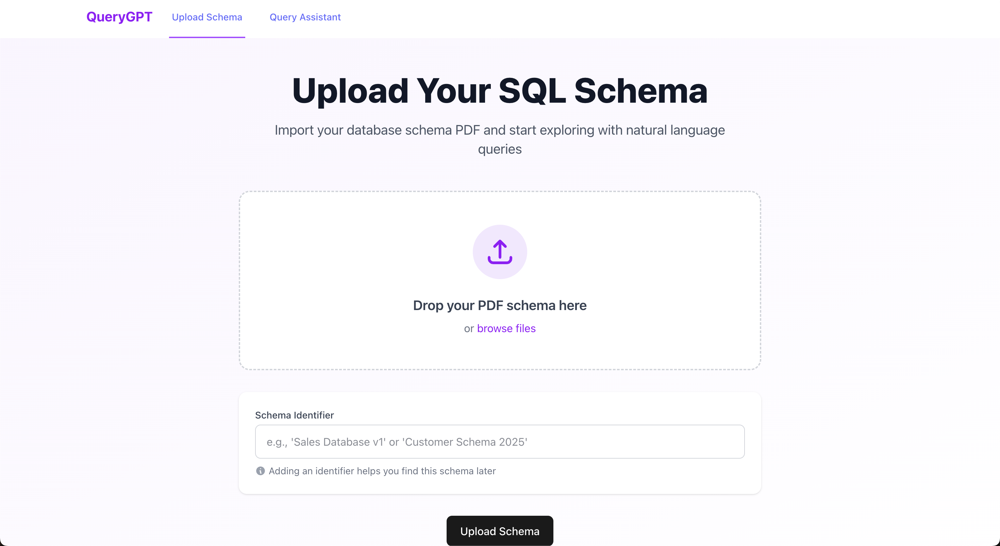
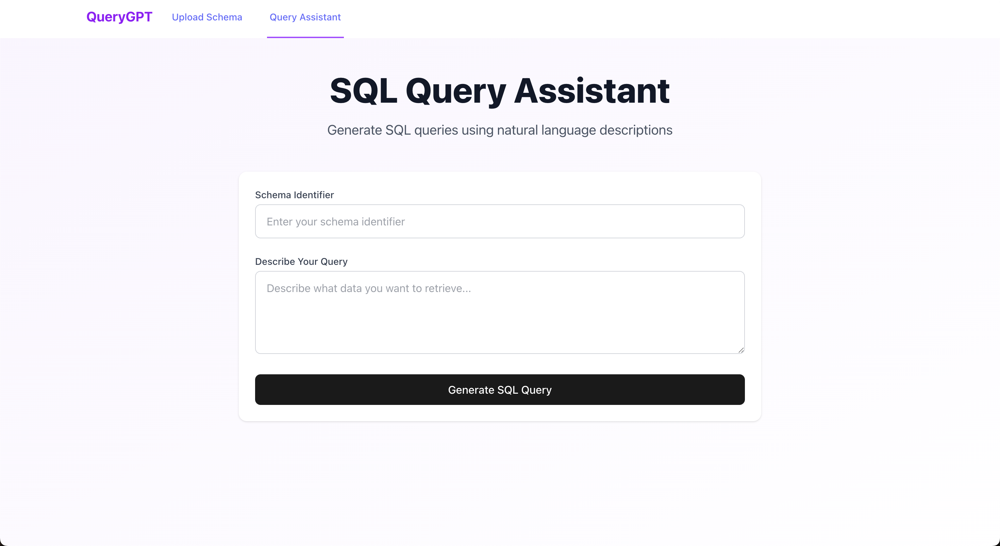

# 🖥️ QueryGPT Frontend Application

<div align="center">


</div>

A modern, responsive React-based frontend application that provides an intuitive interface for interacting with the QueryGPT system. This component focuses on delivering an exceptional user experience with real-time feedback and elegant visualizations.

<div align="center">

</div>

## 📱 Application Screenshots

<div align="center">
  <div style="display: flex; justify-content: space-around; margin-bottom: 20px;">
    <div style="width: 48%;">
      
      <p><em>Schema Upload Interface: Upload and manage your database schema documents</em></p>
    </div>
    <div style="width: 48%;">
      
      <p><em>Query Assistant: Natural language to SQL conversion interface</em></p>
    </div>
  </div>
</div>

## 🎯 User Experience Features

- **📤 Intuitive Document Upload**: Drag-and-drop interface with visual feedback for schema document upload
- **💬 Conversational Query Interface**: Clean, chat-like interface for natural language interaction
- **📊 SQL Visualization**: Beautifully formatted display of generated SQL queries with syntax highlighting
- **📈 Schema Representation**: Visual diagrams of database structure for better understanding
- **🕒 Query History & Management**: Convenient access to past queries with the ability to refine and reuse

## 🔧 Technical Stack

<div align="center">

<table>
  <tr>
    <td align="center"></td>
    <td><b>React.js</b></td>
    <td>UI library with TypeScript for type safety</td>
  </tr>
  <tr>
    <td align="center"></td>
    <td><b>Vite</b></td>
    <td>Next generation frontend tooling</td>
  </tr>
  <tr>
    <td align="center"></td>
    <td><b>TailwindCSS</b></td>
    <td>Utility-first CSS framework</td>
  </tr>
  <tr>
    <td align="center">📊</td>
    <td><b>CodeMirror</b></td>
    <td>SQL syntax highlighting</td>
  </tr>
  <tr>
    <td align="center">📄</td>
    <td><b>PDF.js</b></td>
    <td>PDF preview and processing</td>
  </tr>
  <tr>
    <td align="center">🔄</td>
    <td><b>React Query</b></td>
    <td>Data fetching and state management</td>
  </tr>
</table>

</div>

## 🚀 Getting Started

### Local Development Setup

```bash
# Install dependencies
npm install

# Start development server
npm run dev

# Visit http://localhost:5173 in your browser
```

### Build for Production

```bash
# Generate production build
npm run build

# Preview production build
npm run preview
```

## 📁 Project Structure

<div align="center">

```
frontend/
├── 📄 package.json          # Package configuration
├── 📄 index.html            # Entry HTML file
├── 📄 vite.config.js        # Vite configuration
├── 📄 tailwind.config.js    # TailwindCSS configuration
├── 📄 eslint.config.js      # ESLint configuration
├── 📁 public/               # Static assets
│   └── 📄 vite.svg          # Vite logo
└── 📁 src/                  # Source code
    ├── 📄 main.jsx          # Application entry point
    ├── 📄 App.jsx           # Root component
    ├── 📄 index.css         # Global styles
    ├── 📁 assets/           # Images and resources
    ├── 📁 components/       # Reusable UI components
    │   ├── 📁 header/       # Header components
    │   └── 📁 upload/       # Upload components
    ├── 📁 context/          # React context providers
    └── 📁 pages/            # Page components
```

</div>

## 💻 Available Scripts

<table>
  <tr>
    <th>Command</th>
    <th>Description</th>
  </tr>
  <tr>
    <td><code>npm run dev</code></td>
    <td>Start development server with hot module replacement</td>
  </tr>
  <tr>
    <td><code>npm run build</code></td>
    <td>Build for production with optimizations</td>
  </tr>
  <tr>
    <td><code>npm run preview</code></td>
    <td>Preview production build locally</td>
  </tr>
  <tr>
    <td><code>npm run lint</code></td>
    <td>Run ESLint to check code quality</td>
  </tr>
  <tr>
    <td><code>npm test</code></td>
    <td>Execute test suite</td>
  </tr>
</table>

## 🎨 Theme and Styling

The application features a modern, responsive design with:

- Light/Dark mode toggle
- Responsive layouts for all device sizes
- Smooth animations and transitions
- Accessible color schemes
- Consistent typography and spacing

<div align="center">

</div>
